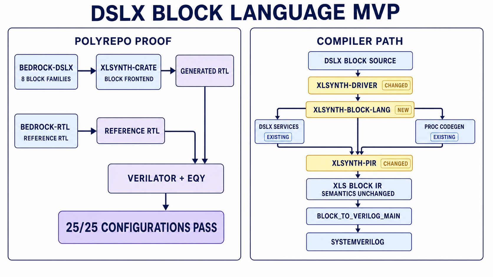

# DSLX blocks: explicit RTL in the XLS ecosystem

Date: 2026-07-06

The MVP adds an experimental `block` construct for users who want to describe
RTL structure in DSLX, not ask XLS to schedule it. A block has ordered ports,
named registers, combinational logic, hierarchy, assertions, and coverage. It
lowers to native XLS Block IR and then goes through the existing XLS
SystemVerilog backend.

The main design choice was restraint. Expressions, types, parametrics, imports,
`let`, `if`, `match`, `for`, and function calls are still ordinary DSLX. The
new frontend only owns the structural shell that DSLX did not have. It does not
add nonblocking-assignment syntax, a second type system, a scheduler, or new
Block IR semantics.

## What writing a block feels like

A user writes a `pub block` with a typed, ordered port list. The MVP accepts one
positive-edge clock and one synchronous active-high or active-low reset. Reset
keeps that type at the interface and is also readable as a one-bit value in
combinational logic.

Inside the block:

- `let` and function calls are combinational DSLX. They are never retimed.
- `reg` declares one register contract. `next` is required; omitted `en` means
  `true`; omitted `init_value` means the register has no reset value.
- `init_value` is the value loaded by synchronous reset. It is not an
  `initial`/power-on value, and it may be a dynamic combinational expression.
- All register updates are concurrent and read current state.
- `assign` drives each output exactly once.
- `inst` creates a child block or a proc lowered by the official XLS proc flow.
- `assert!` and `cover!` are current-cycle properties, automatically disabled
  while reset is active.

Names must be declared before use, and shadowing is rejected. When a register
must be read earlier in the source, `declreg` provides an explicit forward
declaration. This keeps the normal case compact without weakening lexical
ordering.

The user-facing flow is two commands:

```shell
xlsynth-driver dslx-block2ir \
  --dslx_input_file=br_flow_reg_fwd.x \
  --param=WIDTH=u32:8 > br_flow_reg_fwd.ir

xlsynth-driver --toolchain=/path/to/xlsynth-toolchain.toml \
  dslx-block2sv \
  --dslx_input_file=br_flow_reg_fwd.x \
  --param=WIDTH=u32:8 > br_flow_reg_fwd.sv
```

The first command returns verified, package-form Block IR. The second uses the
official XLS Block IR-to-SystemVerilog tool. A toolchain is optional for an
ordinary Block IR compile, required for proc instances, and always required for
SystemVerilog generation.

## Example 1: a one-entry ready/valid register

The Bedrock `br_flow_reg_fwd` port shows the basic model. Its SystemVerilog
implementation uses one resettable valid register and one enabled,
non-resettable data register. The DSLX block says the same thing directly:

```dslx
pub block br_flow_reg_fwd<WIDTH: u32 = {u32:1}>(
  input clk: clock,
  input rst: reset<active_high, sync>,
  output push_ready: bool,
  input push_valid: bool,
  input push_data: uN[WIDTH],
  input pop_ready: bool,
  output pop_valid: bool,
  output pop_data: uN[WIDTH],
) {
  reg pop_valid_r: bool {
    init_value: false,
    next: push_valid || !(pop_ready || !pop_valid_r),
  }
  reg pop_data_r: uN[WIDTH] {
    en: (pop_ready || !pop_valid_r) && push_valid,
    next: push_data,
  }

  assign push_ready = pop_ready || !pop_valid_r;
  assign pop_valid = pop_valid_r;
  assign pop_data = pop_data_r;
}
```

There is no `<=` operator and no sequential statement ordering to reason about.
The two `reg` contracts become named Block IR registers and writes. Reset has
priority over enable. `pop_data_r` has no reset path because `pop_valid_r`
qualifies it, matching the original RTL. The checked-in port also adds
reset-masked assertions and covers without changing the datapath.

## Example 2: a parametric LRU arbiter

`br_arb_lru` shows how the block shell composes with the rest of DSLX. The
priority algorithms are ordinary imported functions; those functions use
standard DSLX `for` expressions over the parametric requester count.

```dslx
import lib.arb.lru;

pub block br_arb_lru<NUM_REQUESTERS: u32 = {u32:1}>(
  input clk: clock,
  input rst: reset<active_high, sync>,
  input enable_priority_update: bool,
  input request: uN[NUM_REQUESTERS],
  output grant: uN[NUM_REQUESTERS],
) {
  declreg state: bits[NUM_REQUESTERS * NUM_REQUESTERS];

  let can_grant = lru::can_grant<NUM_REQUESTERS>(request, state);
  let grant_c = request & can_grant;

  reg state {
    init_value: lru::initial_state<NUM_REQUESTERS>(request),
    en: enable_priority_update && request != uN[NUM_REQUESTERS]:0,
    next: lru::next_state<NUM_REQUESTERS>(state, grant_c),
  }

  assert!((grant_c & request) == grant_c, "grant_implies_request");
  cover!(!enable_priority_update && grant_c != uN[NUM_REQUESTERS]:0,
         "grant_without_state_update");
  assign grant = grant_c;
}
```

`declreg` is useful here because the combinational grant calculation reads
`state` before its register contract appears. The state is a parametric matrix,
but the block language needs no new generate grammar: ordinary DSLX functions,
bit operations, and `for` expressions build the combinational network.
The production port adds three more current-cycle checks; the datapath above is
complete, while the property list is shortened for readability.

## How it fits into XLS



Yellow highlights the three software components changed by the MVP: the driver,
the new block frontend, and `xlsynth-pir`. Every unchanged compiler-path box is
blue, including XLS Block IR, whose semantics remain unchanged.

`xlsynth-block-lang` parses block structure, enforces the source namespace, and
elaborates structural constants. It delegates ordinary expressions and
functions to the existing DSLX parser, typechecker, constexpr interpreter, and
optimizer. It then constructs native Block IR through `xlsynth-pir`.
`xlsynth-driver` remains a thin CLI.

The principal lower-level data-model additions are an opt-in ordered-port
vector in `xlsynth-pir::BlockMetadata` and an explicit kind on PIR
instantiations. Existing lookup maps and legacy canonical port ordering remain
the default. Proc instances take a side path through official
`ir_converter_main` and `codegen_main`; the generated child Block IR closure is
verified, renamed deterministically, and instantiated rather than
reinterpreted.

Most importantly, XLS Block IR has not changed. Ports are ports, registers are
registers, and instances are instances. The MVP adds a source path to those
objects. It does not flatten state or translate it into a behavioral substitute.

## What the demo proved

The demonstration ported eight Bedrock module families: an LRU arbiter, a
counter, forward and reverse flow registers, an LRU flow mux, SECDED encode and
decode, and a FIFO controller. Across 25 representative parameterizations:

- all Block IR artifacts verified and round-tripped;
- all 25 generated designs passed Slang and Verilator lint;
- all 25 passed three deterministic 500-cycle differential simulations against
  the original `bedrock-rtl`, including exhaustive width-4 SECDED codewords;
- all 25 passed the depth-12 EQY temporal-induction strategy; and
- the end-to-end composition test combined custom logic, function calls, a
  proc wrapper, block hierarchy, and combinational Verilog FFI, then
  round-tripped, generated SystemVerilog, and simulated.

The affected regression surface also passed 71 block-frontend tests, 534 PIR
unit tests and their integrations, the driver tests, and the required codegen
and simulation E2Es. Generated artifacts were rebuilt and compared byte for
byte before the final simulation and equivalence campaigns. This does not prove
that every XLS configuration is unchanged, but it gives concrete evidence that
the MVP is close to strictly additive: legacy PIR behavior stays the default,
ordinary DSLX still uses its existing frontend, and the established Block IR
and codegen contracts remain in place.

## Deliberate MVP limits

The prototype is DSLX-adjacent in `xlsynth-crate`; it is not yet integrated into
the upstream DSLX parser. It supports one positive-edge clock and one
synchronous reset, not multiple clock domains, negative edges, or asynchronous
reset. DSLX and Block IR are two-state, so X/Z checks, final assertions, and
temporal property syntax are not approximated. Properties are current-cycle
only.

Generated arrays of instances, a dedicated memory declaration, and sequential
external modules are also out of scope. Direct combinational
`#[extern_verilog]` calls work, while hidden FFI calls and `extern block`
semantics do not. Proc wrapping uses a fixed one-stage, unit-delay schedule and
requires external XLS tools. The Bedrock FIFO and SECDED ports intentionally
reject unsupported parameter combinations rather than emit a plausible but
unproved design.

Finally, XLS 0.53 requires ordinary function calls to be inlined before Block
IR codegen, so `preserve-names-and-functions` currently preserves `let` names
but warns that function materialization is deferred. SystemVerilog generation
uses the official “combinational” generator because the authored Block IR
already contains its registers; despite the name, that path preserves state,
feedback, hierarchy, reset, assertions, and coverage.
